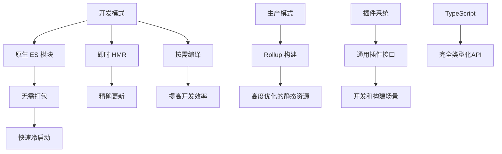

> Wip...

> [!NOTE]
> - [01-开发服务器](./01-dev-server.md)
> - [02-模块解析和加载](./02-module-reslove.md)
> - [03-HMR](./03-hmr.md)
> - [04-插件系统](./04-plugin-system.md)

这是一个系列文章，主要面对那些想了解 Vite 基础原理的读者。当然，其实更多的是记录我自己的学习过程，如有错误，欢迎指正 »

## Vite 主要特性和优势

Vite 是一个现代化的前端构建工具，它具有以下主要特性和优势:

- 极快的冷启动： 利用原生 ES 模块，无需打包即可直接启动开发服务器。
- 即时的热模块替换（HMR）： 精确和快速的更新，无需刷新页面。
- 真正的按需编译： 只编译浏览器请求的内容，大大提高了开发效率。
- 优化的构建： 使用 Rollup 进行生产环境构建，输出高度优化的静态资源。
- 通用的插件接口： 支持开发和构建两种场景的插件 API。
- 完全类型化的 API： 使用 TypeScript 编写，提供完整的类型定义。

为了更直观地展示 Vite 的工作流程，我们可以使用一个流程图来说明:

### 开发服务器

Vite的开发服务器基于原生ES模块实现，主要特点包括：

1. 中间件架构：使用 Connect 作为中间件框架，处理各种 HTTP 请求。
2. 模块重写：拦截浏览器的 ES 模块请求，进行路径重写和内容转换。
3. 按需编译：只在浏览器请求模块时才编译它们，大大加快了启动速度。
4. 源码映射：为转换后的代码生成 sourcemap，方便调试。

### 依赖预构建

1. 原因：
   1. 统一格式，cjs 和 umd 到 esm 模块
   2. 性能：将有许多内部 esm 模块的依赖项转为单个模块
2. 缓存处理：
   1. 预构建依赖使用强缓存
   2. 源码模块使用协商缓存
3. 裸模块导入转换

### HMR

Vite 的 HMR 机制基于原生 ES 模块，实现了精确的更新而无需刷新整个页面:

1. WebSocket 通信：服务器和客户端通过 WebSocket 保持连接，实时通知更新。
2. 模块图：维护一个模块依赖图，精确定位需要更新的模块。
3. 边界分析：确定更新的边界，只重新执行必要的模块。
4. 状态保留：尽可能保留应用程序的状态，只更新变化的部分。

### 构建优化

Vite 在生产环境使用 Rollup 进行构建，采用了多种优化策略：

1. **css 代码分割**：异步加载的模块，它所加载的 css 也会被单独打包成一个模块。
2. **预加载指令生成**：为入口 chunk 和 HTML 中直接引入自动生成的 `<link rel="modulepreload">` 指令。
3. **异步 chunk 加载优化**：vite 会扫描所有异步 chunk 并找到他们之间的共同依赖，并打包为一个单独的文件，减少网络请求嵌套和模块被重复加载的问题。
4. **资源内联**：小型资源内联到 bundle 中，减少 http 请求。
5. **Tree Shaking**：消除未使用的代码，减小最终包的大小。
